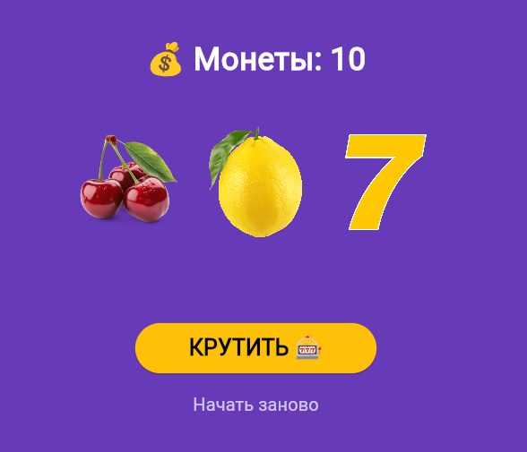

# Учебное приложение. 🎰 Слот-машина
---

Простое Flutter-приложение - симулятор казино. Крути барабаны, собирай одинаковые символы и выигрывай монеты.

## Скриншоты

|Главный экран|Победа|Монеты закончились|
|:-:|:-:|:-:|
||||

## Как играть

* Нажмите **КРУТИТЬ** чтобы запустить барабаны
* Три одинаковых символы - победа (+3 монеты)
* Три семерки - джекпот (+10 монет)
* Разные символы - проигрыш (-1 монета)
* Начните заново кнопкой **Начать заново**

## Запуск проекта

**Требования:** Flutter 3.x, Dart 3.x

```
# Клонировать репозиторий
git clone https://github.com/MorOlesya/Flutter_Lab7.git

# Перейти в папку
cd slot_machine

# Установить зависимости
flutter pub get

# Запустить в Edge
flutter run -d edge
```

## Установка на Android

Скачать готовый APK:

[app-release.apk](build/app/outputs/flutter-apk/app-release.apk)пше 

## Технологии

* **Flutter** 3.41.2
* **Dart** 3.11.0
* **Платформы:** Web, Android

## Автор

**ФИО:** Морозова О. С.
**Группа:** ИСП-231

Лабораторная работа №7, 2026